## 🔥 Bryce Cloud

本项目是一个基于 Vue/Element Plus 和 Spring Boot/Spring Cloud & Alibaba 前后端分离的分布式微服务架构。

* 前端工程：[https://github.com/brycehan/bryce-admin](https://github.com/brycehan/bryce-admin)
* 开发平台后端工程（单体版）：[https://github.com/brycehan/bryce-boot](https://github.com/brycehan/bryce-boot)
* 开发平台后端工程（微服务）：[https://github.com/brycehan/bryce-cloud](https://github.com/brycehan/bryce-cloud)
* 超好用的代码生成器：[https://github.com/brycehan/bryce-generator](https://github.com/brycehan/bryce-generator)

## 🐳 平台简介

布莱斯是一套全部开源的快速开发平台，毫无保留给个人及企业免费使用。

* 采用前后端分离的模式，前端技术栈（[Vue3](https://v3.cn.vuejs.org) [Element Plus](https://element-plus.org/zh-CN) [Vite](https://cn.vitejs.dev)）。
* 后端采用Spring Boot、Spring Cloud & Alibaba，分为单体版和微服务两个版本。
* 注册中心、配置中心选型Nacos，权限认证使用Redis。
* 流量控制框架选型Sentinel，分布式事务选型Seata。
* 如需不分微服务架构，请移步 [bryce-boot](https://github.com/brycehan/bryce-boot)。

## 📌 版本说明

| 核心库                  | 当前版本                                                                               |
|----------------------|------------------------------------------------------------------------------------|
| JDK                  |                           |
| Spring Boot          |               |
| Spring Cloud         |            |
| Spring Cloud Alibaba |  |
| Mybatis Plus         |               |
| Node.js              |                     |
| Vue.js               |                    |

## 🎨 文件结构

~~~
bryce-cloud
├── bryce-cloud-api          // 接口模块
│       └── bryce-cloud-email-api                     // 邮件接口
│       └── bryce-cloud-sms-api                       // 短信接口
│       └── bryce-cloud-storage-api                   // 存储接口
│       └── bryce-cloud-system-api                    // 系统接口
├── bryce-cloud-auth         // 认证中心 [9011]
├── bryce-cloud-common       // 通用模块
│       └── bryce-common-api                          // 接口模块
│       └── bryce-common-cloud                        // 通用服务
│       └── bryce-common-core                         // 核心模块
│       └── bryce-common-mybatis                      // ORM模块
│       └── bryce-common-operatelog                   // 操作日志
│       └── bryce-common-rabbitmq                     // 分布式消息队列
│       └── bryce-common-security                     // 安全模块
│       └── bryce-common-server                       // 服务模块
│       └── bryce-common-xxl-job                      // 分布式定时任务
├── bryce-cloud-gateway      // 网关模块 [8090]
├── bryce-cloud-module       // 业务模块
│       └── bryce-cloud-email                         // 邮件服务 [9012]
│       └── bryce-cloud-generator                     // 代码生成 [9013] 
│       └── bryce-cloud-monitor                       // 监控中心 [9014] 
│       └── bryce-cloud-sms                           // 短信服务 [9015]
│       └── bryce-cloud-storage                       // 存储服务 [9016]
│       └── bryce-cloud-system                        // 系统服务 [9017]
├── db                       // 数据库脚本
│       └── dm8                                       // 达梦数据库
│       └── mysql                                     // MySQL数据库
│       └── postgresql                                // PG数据库
├── docker                   // 容器模块
├── pom.xml                  // 公共依赖
~~~

## 🍪 架构图

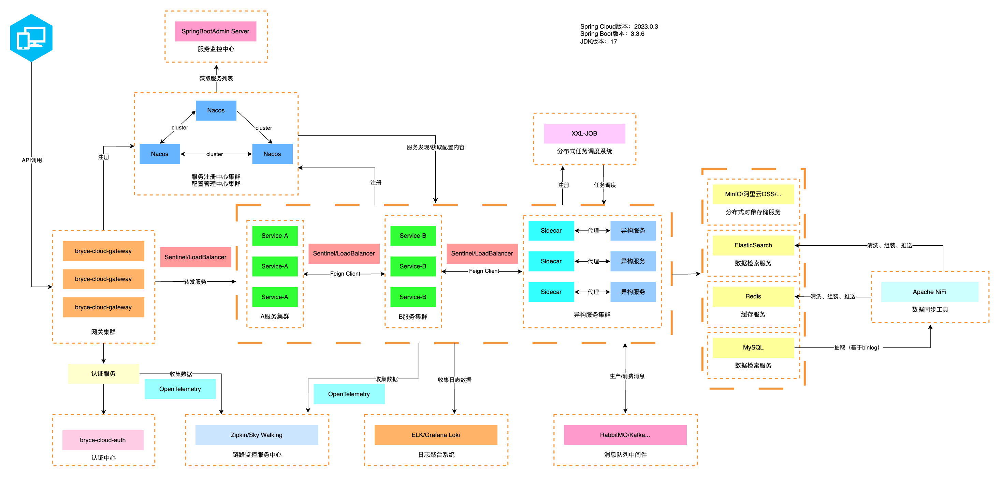

## 🌭 内置功能

1.  用户管理：用户是系统操作者，该功能主要完成系统用户配置。
2.  部门管理：配置系统组织部门（公司、部门、小组），树结构展现支持数据权限。
3.  岗位管理：配置系统用户所属担任职务。
4.  菜单管理：配置系统菜单，操作权限，按钮权限标识等。
5.  角色管理：角色菜单权限分配、设置角色按部门进行数据范围权限划分。
6.  字典管理：对系统中经常使用的一些较为固定的数据进行维护。
7.  参数管理：对系统动态配置常用参数。
8.  通知公告：系统通知公告信息发布维护。
9.  操作日志：系统正常操作日志记录和查询；系统异常信息日志记录和查询。
10.  登录日志：系统登录日志记录查询包含登录异常。
11.  在线用户：当前系统中活跃用户状态监控。
12.  XXL-JOB定时任务：在线（添加、修改、删除)任务调度包含执行结果日志。
13.  代码生成：前后端代码的生成（java、html、xml、sql）支持CRUD下载 。
14.  系统接口：根据业务代码自动生成相关的api接口文档。
15.  服务监控：监视当前系统CPU、内存、磁盘、堆栈等相关信息。

## 😎 演示图

|     | 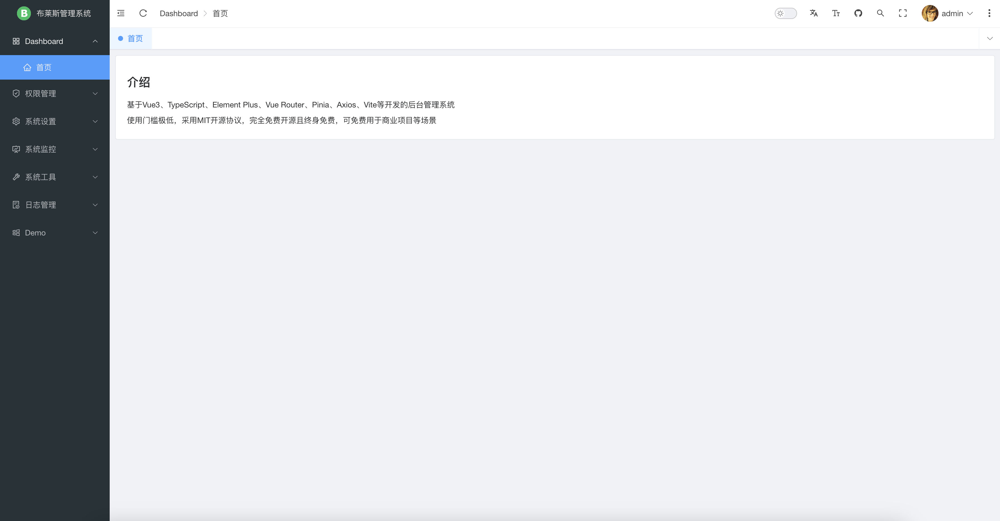      |
|-----------------------------------|-------------------------------------|
| 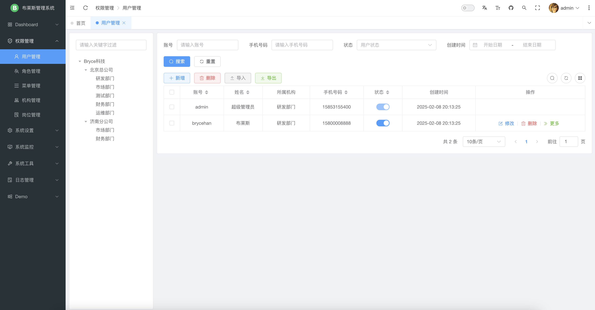  | 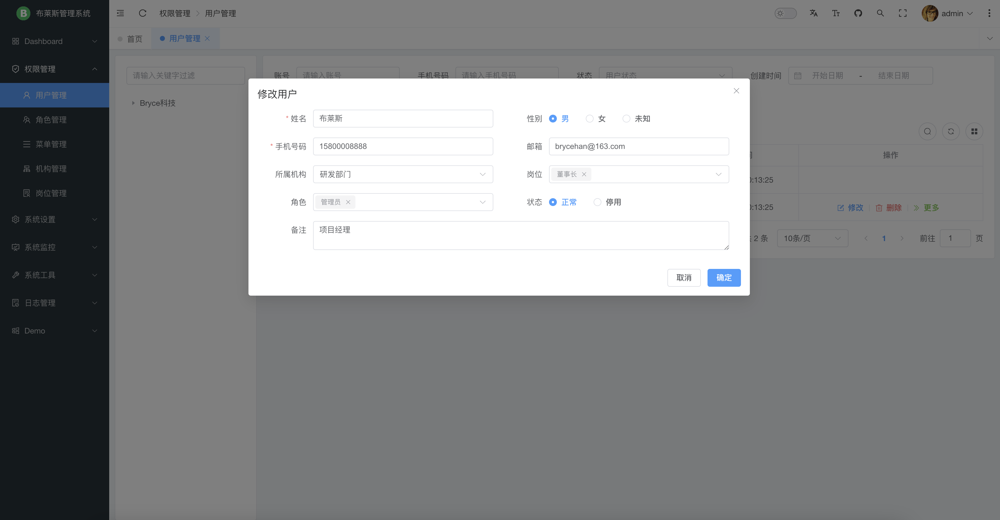    |
| 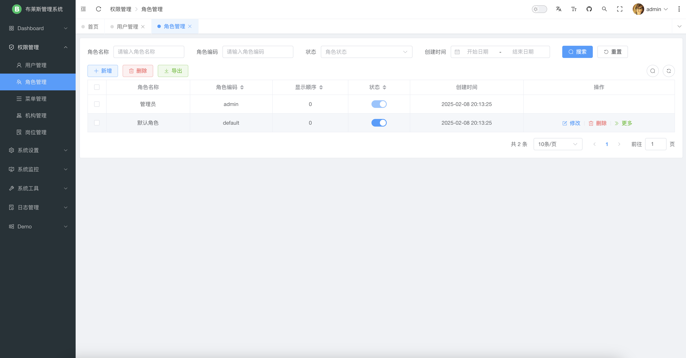  | 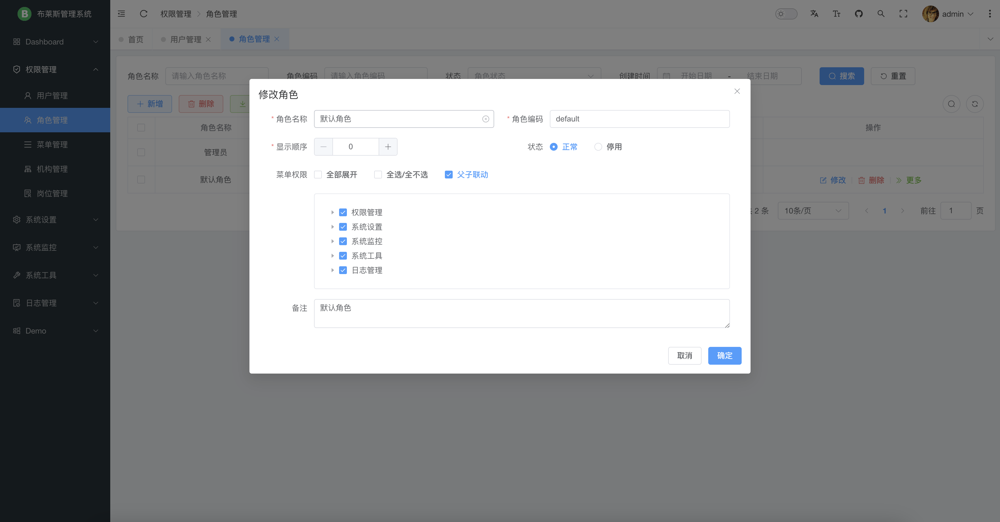    |
|   | 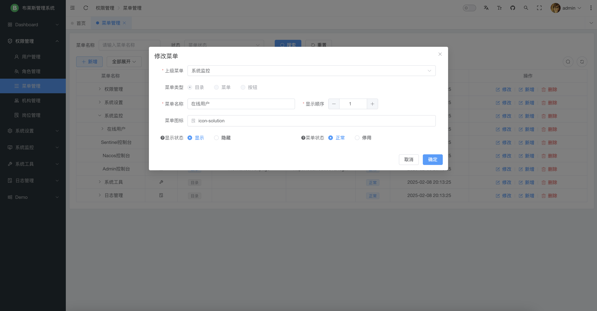    |
| 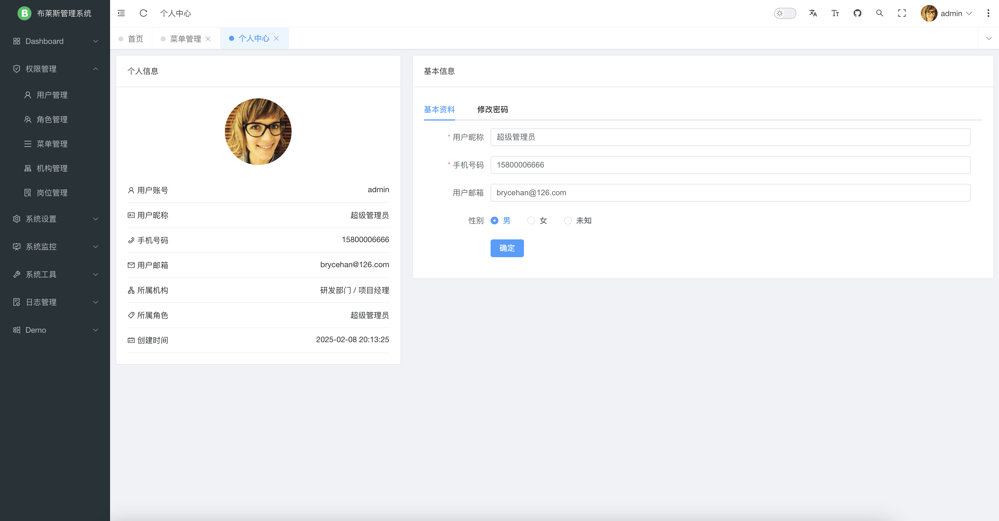  |    |
| 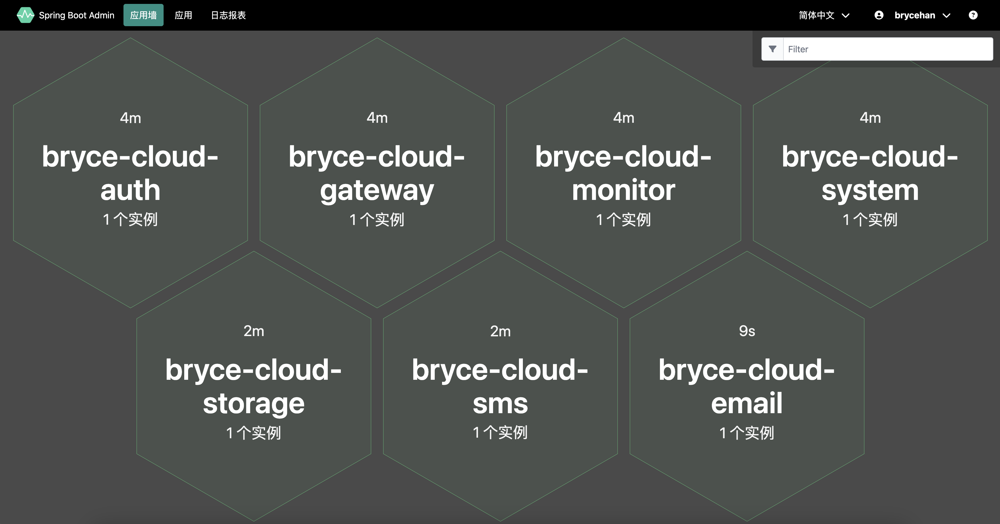 | 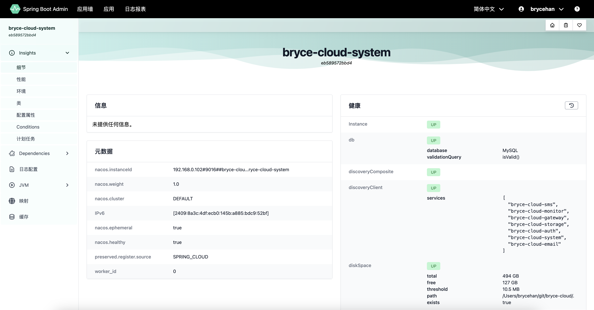 |
|  |  |
| 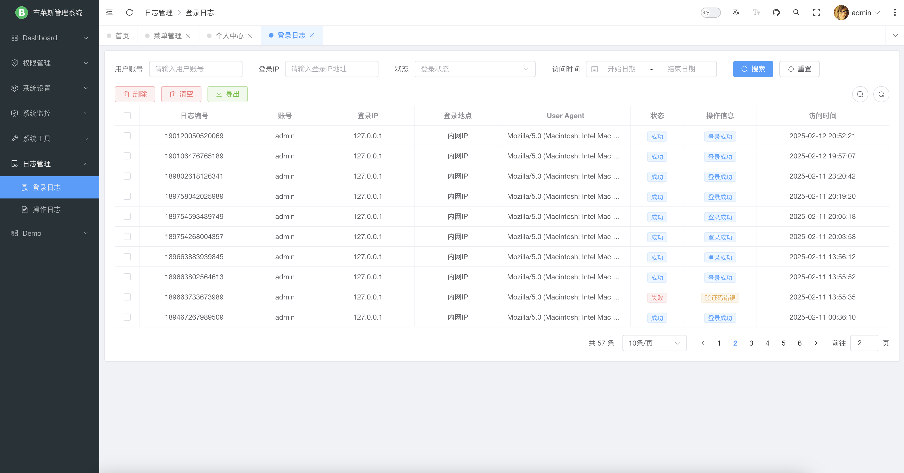 | 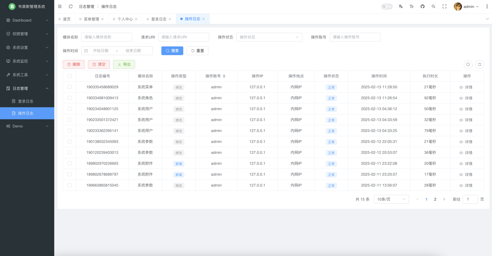   |

